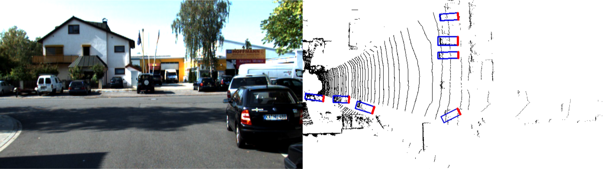
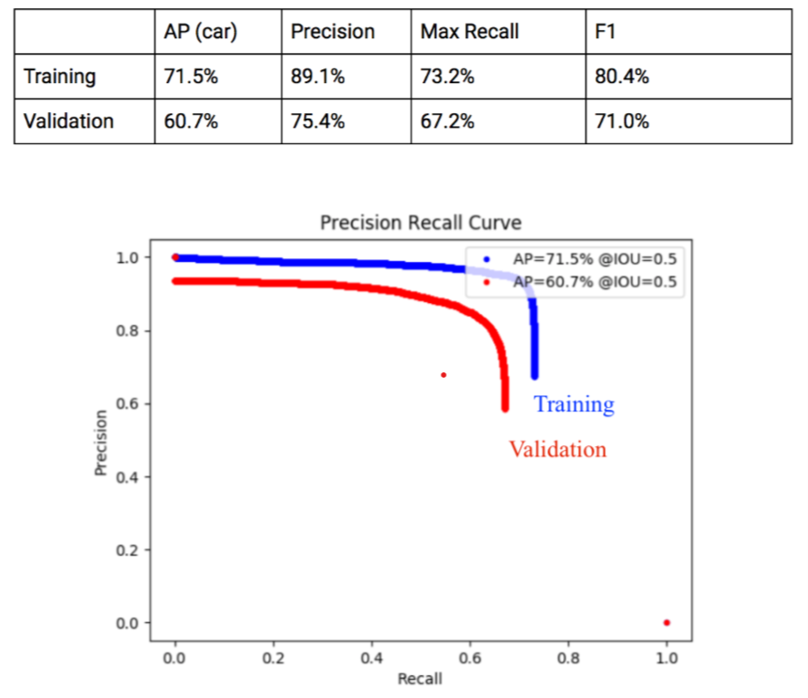

# PIXOR: Real-time 3D Object Detection from Point Clouds

This is a custom implementation of the paper from Uber ATG using PyTorch 1.0. It represents the driving scene using lidar data in the Birds' Eye View (BEV) and uses a single stage object detector to predict the poses of road objects with respect to the car

[PIXOR: Real-time 3D Object Detection from Point Clouds](http://openaccess.thecvf.com/content_cvpr_2018/papers/Yang_PIXOR_Real-Time_3D_CVPR_2018_paper.pdf)



## Highlights
- **PyTorch 1.0** Reproduced and trained from scratch using the **KITTI** dataset
- **Fast** Custom LiDAR preprocessing using C++ 
- **Multi-GPU** Training and Pytorch *MultiProcessing* package to speed up non-maximum suppression during evaluation
- **Tensorboard** Visualize trainig progress using Tensorboard
- **KITTI and ROSBAG Demo** Scripts that supports running inferences directly on raw KITTI data or custom rosbags.


## Install
Dependencies: 
- Python 3.5(3.6)
- Pytorch (Follow Official Installation Guideline)
- Tensorflow (see their website)
- Numpy, MatplotLib, OpenCV3
- PyKitti (for running on KITTI raw dataset)
- gcc

```
pip install shapely numpy matplotlib
git clone https://github.com/philip-huang/PIXOR
cd PIXOR/srcs/preprocess
make
```

(Optional) If you want to run this project on a custom rosbag containing Velodyne HDL64 scans the system must be Linux with ROS kinetic installed.
You also need to install the [velodyne driver](https://github.com/ros-drivers/velodyne) into the velodyne_ws folder.

Set up the velodyne workspace by running ./velodyne_setup.bash and press Ctrl-C as necessary.

## Demo
A helper class is provided in run_kitti.py to simplify writing inference pipelines using pre-trained models. Here is how we would do it. Run this from the src folder (suppose I have already downloaded my KITTI raw data and extracted to somewhere)
```
from run_kitti import *

def make_kitti_video():
     
    basedir = '/mnt/ssd2/od/KITTI/raw'
    date = '2011_09_26'
    drive = '0035'
    dataset = pykitti.raw(basedir, date, drive)
   
    videoname = "detection_{}_{}.avi".format(date, drive)
    save_path = os.path.join(basedir, date, "{}_drive_{}_sync".format(date, drive), videoname)    
    run(dataset, save_path)

make_kitti_video()
``` 

## Training and Evaluation
Our Training Result (as of Dec 2018)


All configuration (hyperparameters, GPUs, etc) should be put in a **config.json** file and save to the directory *srcs/experiments/$exp_name$*
To train
```
python srcs/main.py train (--name=$exp_name$)
```
To evaluate an experiment
```
python srcs/main.py val (--name=$exp_name$)
```
To display a sample result
```
python srcs/main.py test --name=$exp_name$
```
To view tensorboard
```
tensorboard --logdir=srcs/logs/$exp_name$
```

## TODO
* [ ] Improve training accuracy on KITTI dataset
* [ ] Data augmentation
* [ ] Generalization gap on custom driving sequences
* [ ] Data Collection
* [ ] Improve model (possible idea: use map as a prior)

## Credits
Project Contributors
* Philip Huang
* Allan Liu 

Paper Citation below
```


@inproceedings{yang2018pixor,
  title={PIXOR: Real-Time 3D Object Detection From Point Clouds},
  author={Yang, Bin and Luo, Wenjie and Urtasun, Raquel}
}
```

We would like to thank [aUToronto](https://www.autodrive.utoronto.ca/) for genersouly sponsoring GPUs for this project

